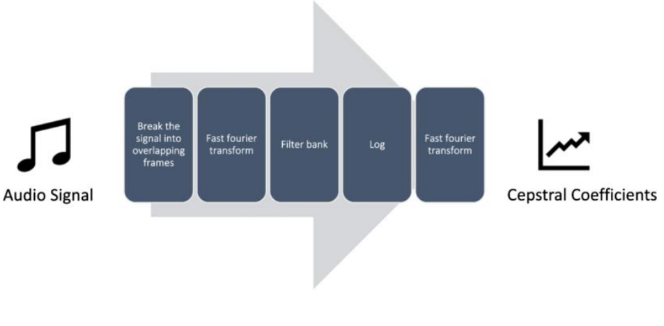
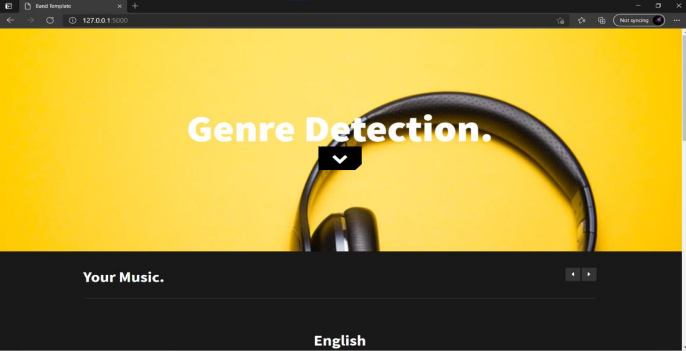
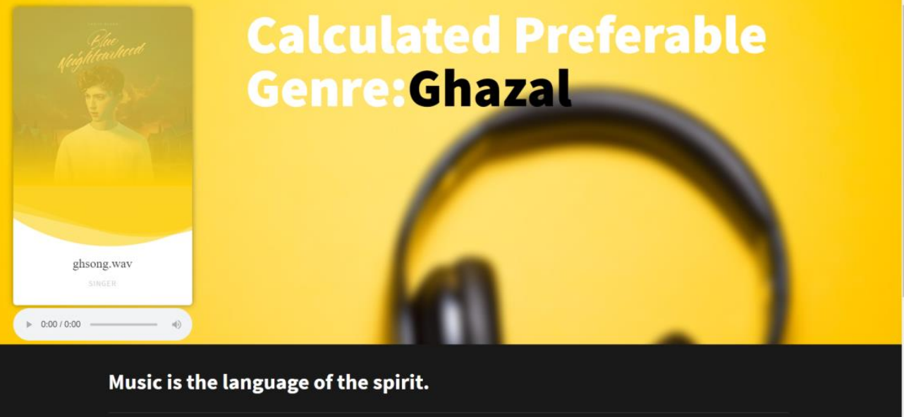
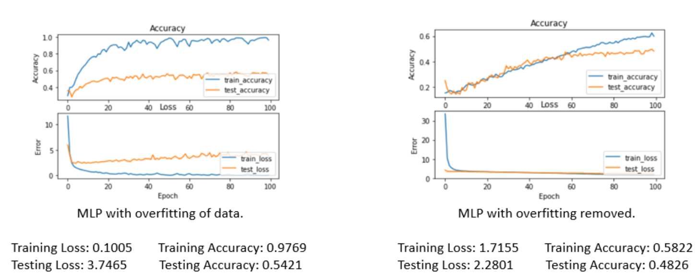
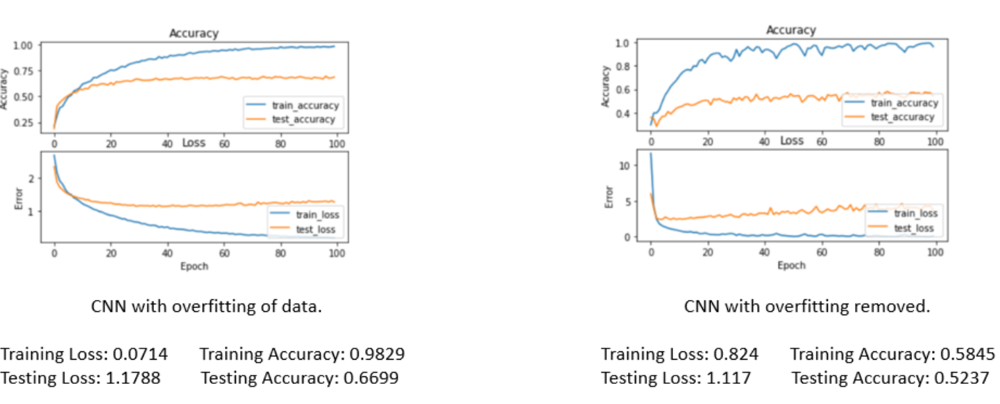
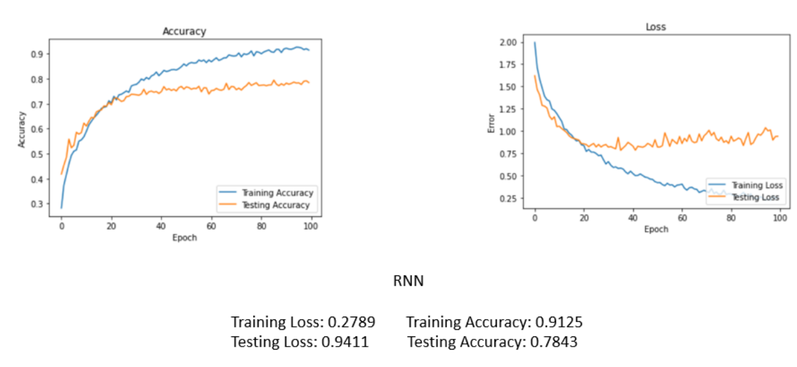
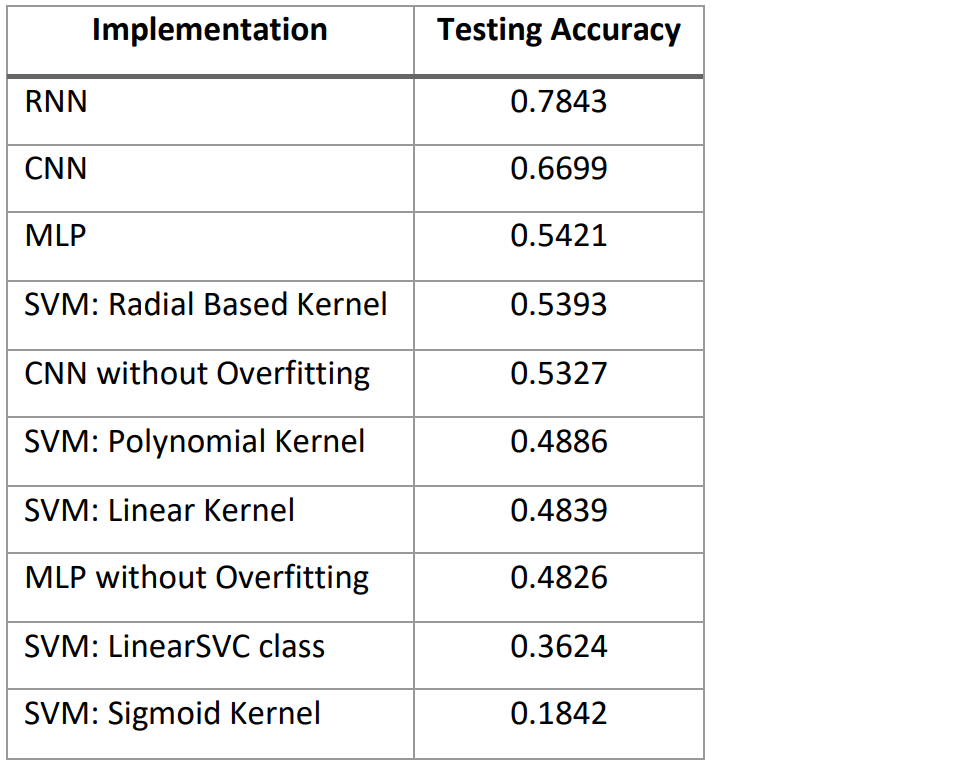

# MusicGenreModels
Music genre detection compared with SVM, CNN, RNN and MLP

Our project primarily focused on iterating each of the songs from their respective genres and 
dividing them into segments, thus the feature extraction of MFCC (The Mel Frequency Cepstral 
Coefficients) was done and the respective genres corresponding to their respective MFCCs were 
stored in a JSON object for easy retrieval and dataset training.

MFCC
The Mel Frequency Cepstral Coefficients, abbreviated as MFCCs are the representation of the short-term power spectrum of a sound. The MFCC considers human perception for sensitivity at 
appropriate frequencies by converting the conventional frequency to the Mel Scale. The Mel scale is 
a scale that relates the perceived frequency of a tone to the actual measured frequency. It scales the 
frequency to match more closely what the human ear can hear. 
MFCCs surpass the human hearing when it comes to identifying small changes in speech at lower 
frequencies. The range of human hearing is 20Hz to 20kHz. If a human were to differentiate between 
two tunes of 300Hz and 400Hz respectively and assume the distance between these two however 
the brain perceived them as a value say 'X', would probably be close to 100Hz. If the same person 
were to assume the distance of two other tunes at 900Hz and 1000Hz respectively, say 'Y', one can 
observe that not only X more inaccurate than Y, but it is also observed most human brains perceive Y 
to be higher than X despite both actual values being a 100Hz. This is where the Mel scale can capture 
the differences accurately.
The working of MFCC can be easily understood by the following flow chart:

Librosa Library
The Librosa library is a python package which is specifically built for audio analysis. 
Librosa’s load function will read in the path to an audio file and return a tuple with two items. The 
first item is an ‘audio time series’ (type: array) corresponding to audio track. The second item in the 
tuple is the sampling rate that was used to process the audio. The default sampling rate (sr) used by 
Librosa is 22050. 
The librosa.load function, primarily used here returns the following:
1. The sample rate sr: which means how many samples are recorded per second.
2. A 2D array that consists of:
The first axis: represents the recorded samples of amplitudes in by determining the change 
in air pressure in the audio.
The second axis: represents the number of channels in the audio.

### Result Comparision 

